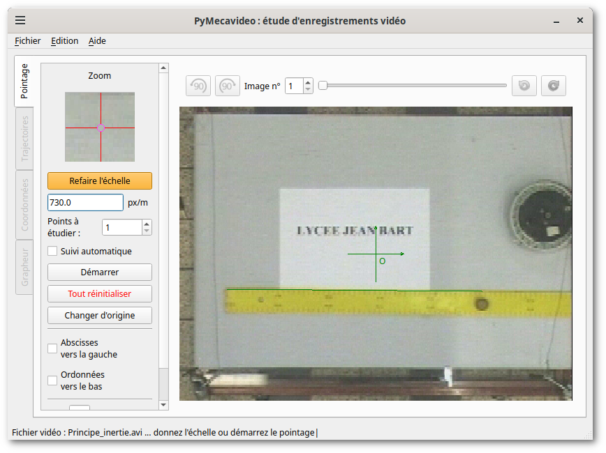
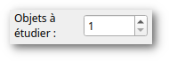
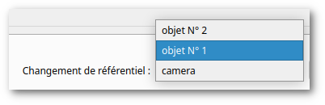
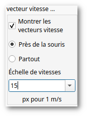

<script src="static/jquery/jquery.js"></script>
<script src="static/jquery-ui/jquery-ui.js"></script>

## Manuel de PyMecaVideo

### Georges Khaznadar

**Résumé**

PyMecaVideo est un logiciel facilitant le repérage de points mobiles
dans une vidéo et d\'en exploiter la cinématique pour des usages de
mesure physique.

------------------------------------------------------------------------

<div id = "toc" class="accordian"></div>

# Introduction{.toc}
## PyMecaVideo, pourquoi faire ?{.toc}

{.leftalign width="350"}

Il est possible de faire des mesures physiques à l'aide d'images, dans
certaines conditions. [ PyMecaVideo]{.symbol} facilite les mesures
physiques faites sur des séquences d'images vidéo. Il suffit de
travailler à partir d'un fichier vidéo de type `AVI`{.computeroutput},
encodé à l'aide d'un codec libre<sup id="a1">[1](#f1)</sup>, 
qui comporte au moins une image dont on peut déterminer
l'échelle.

[ PyMecaVideo]{.symbol} permet d'ouvrir et de décomposer en images la
vidéo, et par des pointages successifs, de suivre le mouvement d'un
point, et éventuellement le mouvement de l'origine d'un référentiel
mobile dans le cadre des images. Les données pointées sont ensuite
exploitables à l'aide de logiciels d'analyse standard.

## Téléchargement et installation{.toc}


[{.leftalign width=350}](http://outilsphysiques.tuxfamily.org/pmwiki.php/Oppl/Pymecavideo)
Les sources de [ PyMecaVideo]{.symbol} sont disponibles parmi
[les « Outils Physiques Pour Linux » hébergés sur le site
*tuxfamily.org*](http://outilsphysiques.tuxfamily.org/wiki/index.php?title=Accueil). 
Pour l'installation sous [ Linux]{.productname}™,
récupérer l'arbre des sources comme expliqué à
[la page spécifique de Pymecavideo](http://outilsphysiques.tuxfamily.org/wiki/index.php?title=Pymecavideo#T.C3.A9l.C3.A9chargements), lancer la commande `git clone git@gitlab.com:oppl/pymecavideo.git`{.computeroutput}
entrer dans le répertoire `pymecavideo/src`{.computeroutput}, et taper la commande suivante :
`make`{.computeroutput}. Cela crée les fichiers manquants (interfaces utilisateur, traductions vers l'anglais).
Depuis ce répertoire-là, une commande `python3 pymecavideo.py`{.computeroutput} permet alors de lancer
l'application.

Il est possible aussi d'obtenir des fichiers binaires, qui sont pris
en charge par le gestionnaire de paquets de votre distribution
préférée.  Actuellement on trouve des paquets pour Debian et Ubuntu, disponibles dans les dépôts
officiels de ces distributions.

## Lancement de PyMecaVideo{.toc}
{.leftalign width="350"}

Quand l'installation est faite à partir d'un paquet approprié,
il est possible de lancer [PyMecaVideo]{.symbol} de diverses façons : 
juste avec les préférences courantes (ce qui charge la précédente
vidéo travaillée si elle est retrouvée), ou avec une vidéo imposée, ou encore
avec la sauvegarde d'une précédente session de travail.

<div style="clear:both;"/>

En *ligne de commande*, il est possible de taper :

- `pymecavideo`{.computeroutput}, ce qui lance [PyMecaVideo]{.symbol} avec les 
   préférences courantes ;
- `pymecavideo nom_de_fichier_video.avi`{.computeroutput}, ce qui lance [PyMecaVideo]{.symbol} avec
   un nouveau fichier vidéo ;
- `pymecavideo fichier_de_sauvegarde.mecavideo`{.computeroutput}, ce qui lance 
  [PyMecaVideo]{.symbol} avec la sauvegarde d'un ancienne session de travail.

On peut aussi le lancer à partir du menu graphique de votre gestionnaire de fenêtre :
[KDE]{.symbol}, [Gnome]{.symbol} ou  [Cinnamon]{.symbol}, etc. intègrent l'application dans le menu
si vous faites une installation à l'aide d'un paquet.

[Dans le cas de KDE,]{.term}

:   l'application est accessible par les menus
    Éducatif ↦ Science ↦ PyMecaVideo.

[Dans le cas de Gnome ou Cinnamon,]{.term}

:   l'application est accessible par les menus
    Éducation ↦ PyMecaVideo.


Voici l'icône de l'application :
[{width="32"}](curseur_cible.svg)


## Préparer une vidéo pour pouvoir la traiter{.toc}

La préparation de la vidéo commence dès la prise de vues. Les
points-clés sont les suivants :

-   Choisir un bon éclairage. Les éclairages fluorescents posent parfois
    problème, car leur intensité varie à des fréquences proches de celle
	de la vidéo, et cela peut engendrer quelquefois des phénomènes stroboscopiques.
    D'autre part, pour les caméras vidéo disposant de bons
    automatismes, un éclairage suffisant facilite le choix de temps de
    pose courts, plus favorables à l'acquisition de données.

-   La scène doit posséder un bon contraste. En particulier les objets
    à suivre doivent se distinguer aisément de leur environnement, par
    la clarté, sinon par la couleur.

-   Il faut penser à laisser dans le cadre un objet de taille connue,
    dans le même plan focal que la scène à filmer. Il est bon de
    documenter la dimension de l'objet-étalon.

-   L'axe optique de la caméra doit être perpendiculaire au plan dans
    lequel se déplace l'objet étudié. Il doit pointer environ vers le
    milieu de la trajectoire probable.

-   On commence à filmer avant l'évènement, on arrête après
    l'évènement. Il est préférable de fixer le début et la fin de la
    séquence vidéo à l'étape de montage.

-   Utiliser un logiciel libre de montage, et couper la séquence
    pertinente. Quelques dizaines d'images au plus suffisent. La choix
    d'un logiciel libre assure que les codecs utilisés ne poseront pas
    de problème à l'avenir. Exemples de logiciels utilisables :
    [Kino](http://fr.wikipedia.org/wiki/Kino_(logiciel)),
    [Cinelerra](http://fr.wikipedia.org/wiki/Cinelerra). 
	La vidéo sera enregistrée dans un conteneur au
    format `.avi`{.computeroutput} ou `.mp4`{.computeroutput},
	`.ogv`{.computeroutput}, etc.

## Utilisation de PyMecaVideo

Il faut bien sûr commencer par charger une vidéo avant de pouvoir en
faire quoi que ce soit. Ça peut se faire au lancement de la commande, en
tapant en ligne de commande :
`pymecavideo nom_de_fichier_video.avi`{.computeroutput}, ou en mode
graphique quand [PyMecaVideo]{.symbol} est lancé, par le menu
Fichier ↦ Ouvrir une vidéo, ou encore si on veut une des vidéos
d'exemple, par le menu Aide ↦ Exemples \...

# L'onglet Pointage{.toc}
## Régler l'échelle{.toc}

{.leftalign}

Quand on dispose d'un fichier vidéo ouvert, le bouton « Définir
l'échelle » est actif, mais la valeur de l'échelle est encore
indéfinie. On peut utiliser le curseur ou le champ de numéro d'image
pour faire apparaître une image autre que la première de la séquence
vidéo. Il faut que l'objet étalon soit dans le champ, et il faut
connaître sa longueur en mètre.

On clique alors sur ce bouton, on renseigne la longueur de
l'objet-étalon dans le dialogue qui surgit (on utilise la virgule ou le
point comme séparateur décimal, indifféremment : par exemple 0,60 m pour
signifier 60 cm), on valide, puis lorsque le curseur de la souris
devient une croix verticale, on réalise un *tirer-glisser* le long
de l'objet-étalon.

{.leftalign}

Quand l'échelle est définie, le bouton précédent devient « Refaire l'échelle » :
on peut donc recommencer à saisir l'échelle à nouveau.

## Choix du nombre d'objets à étudier{.toc}

Par défaut, on étudie le mouvement d'un seul objet, le référentiel
étant celui de la caméra.

{.leftalign}

Il est possible de faire porter l'étude sur deux objets ou plus. Un des
objets de la série pourra plus tard être utilisé comme nouvelle origine
du référentiel pour recalculer une vidéo.

Pour étudier plus d'un objet, il faut modifier la valeur affichée dans
la zone intitulée « Objets à étudier : »

## Pointer les positions{.toc}

{.leftalign}

On peut décider de ne pas commencer le pointage dès la première image.
Dans ce cas, il faut choisir manuellement l'image initiale à l'aide du
curseur en haut à gauche, ou du champ de sélection de numéro d'image.
Le pointage commence quand on clique sur le bouton « Démarrer ».

{.leftalign}

Quand l'acquisition est en cours, une petite phrase dans la ligne de
statut, en bas de la fenêtre, rappelle le numéro du point qu'on est
censé cliquer en suivant.  Les traces des points précédemment cliqués
apparaissent en couleurs. Les points de couleur doivent se suivre sans
discontinuité, sinon c'est la marque d'une faute de pointage.

### Défaire et refaire{.toc}

{.leftalign}

Les icônes « défaire » et « refaire » permettent éventuellement de
rattraper une faute de pointage quand celle-ci est reconnue.

Il n'est possible de refaire des pointages antérieurs que tant qu'on
n'a apporté aucune modification aux pointages précédemment défaits. Dès
qu'un des pointages est corrigé à l'aide de la souris sur la vidéo,
les pointages suivants disparaissent de la liste à refaire, et le bouton
« refaire » est aussitôt inactivé (grisé).

Il est possible d'arrêter le pointage à tout moment, éventuellement
avant la fin de la séquence vidéo.


## Enregistrer le travail{.toc}

Après que des points aient été repérés, il devient possible
d'enregistrer le travail grâce au menu Fichier ↦ Enregistrer le projet
mecavideo. On choisit alors un fichier de type
`.mecavideo`{.computeroutput}<sup id="a2">[2](#f2)</sup>


# Le volet des trajectoires{.toc}

{.leftalign}

Quand les pointages sont faits, il est intéressant d'activer le volet
des trajectoires. Celui-ci permet d'attirer l'attention plus
précisément sur le mouvement et la vitesse des objets étudiés, en
faisant apparaître ceux-ci sans la vidéo où on les avait capturés.

## Représentation absolue ou relative{.toc}


{.leftalign}

Sitôt que plus d'un point fait partie de l'étude, il est possible de
faire afficher les positions et les vitesses de plusieurs façons : soit
les positions et les vitesses « absolues », c'est-à-dire relatives au
référentiel de la caméra, soit les positions et les vitesses
« relatives » par rapport à un des objets étudiés, choisi comme origine
d'un nouveau référentiel.


## L'échelle pour les vecteurs vitesse{.toc}

{.leftalign}

Si on active la case à cocher « Montrer les vecteurs vitesse », il
convient de choisir une échelle appropriée.  L'échelle des vecteurs
vitesse se règle à l'aide d'une zone de saisie intitulée « Échelle de
vitesses ».

Modifiez sa valeur et appuyez sur la touche Entrée pour obtenir une
autre taille des vecteurs vitesse.

Les boutons radio « Près de la souris » et « Partout » permettent d'obtenir
le tracé des vecteurs vitesse au survol des points par la souris, ou alors
à *chaque emplacement* où un vecteur vitesse peut être calculé.

## Créer une vidéo de synthèse{.toc}

{.leftalign}

Dans le volet des trajectoire, sitôt que le référentiel n'est plus la
caméra, le bouton « Voir la vidéo » est activé. Cela permet de voir le
film tel qu'il aurait été si la caméra avait été solidaire de l'objet
sélectionné comme origine du référentiel.

Quand le visionneur de vidéo intégré se lance, il possède un curseur qui
permet de ralentir plus ou moins le déroulement de la vidéo de synthèse.

### Exemple de vidéo de synthèse{.toc}


Les vidéos de synthèse sont intéressantes quand on choisit comme origine
de référentiel un point qui se déplace en ligne droite à vitesse
constante.

Par exemple, on peut étudier simultanément deux points, dans une vidéo
d'un cycliste laissant tomber un objet : un point du cadre du vélo
(P~1~) et un point de l'objet qui tombe (P~2~). Dans le référentiel
terrestre, celui de la caméra si on est en plan fixe, la trajectoire de
P~2~ est une parabole. Mais dans le référentiel galiléen d'origine
P~1~, le point P~2~ est en chute libre sans vitesse initiale.

Dans ces circonstances, la vidéo de synthèse obtenue après avoir choisi
de représenter le volet des trajectoires à partir de l'origine P~1~
montre bien une chute libre.

*NB.* : quand on choisit de réaliser une vidéo de synthèse, il faut
garder présent à l'esprit que les images seront en fait découpées à
l'intérieur des images déjà existantes. Il faut donc éviter de traiter
des images où le point utilisé comme origine s'approche trop du bord
de l'image, parce que ça diminue la taille du gabarit de découpe qui
produit la vidéo de synthèse.

# Le volet des coordonnées{.toc}

{.leftalign}

Le troisième volet de PyMecaVideo est le volet des
coordonnées. Il présente un tableau dont la première colonne représente
des dates en seconde, et les suivantes des coordonnées en mètre des
points étudiés. Ce tableau est juste là pour démystifier le
fonctionnement de [PyMecaVideo]{.symbol}, montrer qu'il ne s'agit que de
traitement numérique.

Il est possible d'ajouter des colonnes calculées dans le tableau, si
on coche les cases des énergie **Cinétique**, **Potentielle**, **Mécanique** ;
enfin, la dernière colonne de ce tableau contient un bouton ornée de l'icône
de [PyMecaVideo]{.symbol}, qui permet de pointer à nouveau (à la main) les
objets correspondant à une ligne défectueuse. On peut aussi pointer les objets
des lignes vides immédiatement voisines d'un pointage déjà fait.

## Exporter des données vers d'autres applications{.toc}

{.leftalign}

Le bouton « Copier les données vers le presse-papiers » permet
d'exporter la totalité du tableau vers le presse-papiers. Il est aussi
possible de sélectionner (de mettre en surbrillance) une partie du tableau
pour que cette partie soit automatiquement copiée vers le
presse-papiers. La partie sélectionnée peut aussi être tirée-glissée
vers d'autres applications. Si ces applications sont capables de
récupérer les données et d'en faire usage, elles accepteront
l'exportation. C'est le cas des traitements de texte et des tableurs
les plus courants.

## Les logiciels de traitement des données{.toc}

{.leftalign}

Le volet « coordonnées » de Pymecavideo permet des exportation
automatiques vers divers logiciels de traitement de données, 
grâce au menu déroulant « Exporter vers... ». Les exportations automatiques
permettent l'ouverture des logiciels choisis, avec les données prêtes à
l'utilisation. Le tableau suivant signale les logiciels supportés,
ainsi que leur disponibilité sous GNU/Linux et sous
[Windows]{.trademark}™.


**Tableau 1. Logiciels libres de traitement des données**

|  Logiciel |   Description |
|-----------|---------------|
| {width="32"} {width="32"} LibreOffice **[Calc](http://fr.openoffice.org/docs/Calc.html)** | Un tableur populaire, plutôt destiné à la bureautique |
|  {width="32"} {width="32"} Python (source) | L'export se fait sous forme de fichier source Python ; il suffit de le reprendre avec un éditeur approprié |
|  {width="32"} {width="32"} Python (numpy) | L'export se fait sous forme de fichier de donnée optimisé pour l'usage avec Python/numpy ; une suggestion est faite pour utiliser ce format |
|  {width="32"} {width="32"} Jupyter notebook | Le format notebook (bloc-note) de Jupyter est exploitable par un serveur Jupyter. Ce serveur peut être installé sur l'ordinateur local, ou accessible à travers Internet ; les blocs-notes de Jupyter sont riches de possibilités éducatives |
|  {width="32"} {width="32"} fichier CSV | Le format CSV (champs séparés par des « virgules » est un format texte universel, reconnu par tous les logiciels de traitement de données. Ici, le séparateur de champs est la tabulation, le séparateur décimal est une virgule |
|  {width="32"} {width="32"} Pandas Dataframe | Pandas est un module pour Python3, qui est dédié au traitement de grandes séries de données, ce qui est à peu près le cas de `numpy` aussi. Le fichier exporté est à un format spécial pour `pandas` et une suggestion est faite pour l'utiliser |

# Les préférences de PyMecaVideo{.toc}

À chaque fermeture de l'application, [ PyMecaVideo]{.symbol} enregistre un fichier de préférences,
nommé `pymecavideo.conf`.
C'est un fichier texte lisible, dont voici un exemple :

``` programlisting
[DEFAULT]
version = pymecavideo 7.3.2-1
proximite = True
lastvideo = data/video/balle-jbart.mp4
videodir = data/video
niveaudbg = 0
sens_x = 1
sens_y = 1
taille = (817,852)
rotation = 90
origine = (311, 389)
index_depart = 12
etalon_m = 0.297
etalon_px = 116.1077086157504
etalon_org = (324, 154)
etalon_ext = (319, 270)
deltat = 0.01
nb_obj = 1
```

L'emplacement de ce fichier sous GNU/Linux est sous le répertoire caché 
`.local/share/pymecavideo` du dossier personnel ; sous Windows il est
placé dans le dossier `C:\Users\<USER>\AppData\Local\pymecavideo`.

Ces préférences comprennent le nom du dernier fichier vidéo ouvert, la
taille de la fenêtre de l'application, la place de l'étalon utilisé pour l'échelle
si celui-ci a été défini, la position et les sens du repère, etc.


# Comment contribuer {.toc}

-   **En rapportant les bogues** aux auteurs. Celles-ci
    peuvent être de diverses natures : dysfonctionnement du logiciel, mauvaise
    présentation de l'interface, souhait d'amélioration, etc.

    Dans chaque cas, soyez très précis : un rapport de bogue ne permet à
    l'auteur de réagir que si celui-ci donne une description détaillée.
    Aussi, n'hésitez pas à jeter un coup d'œil dans les sources du
    logiciel : elles sont à votre disposition ! en fait, plus d'un
    contributeur s'est déjà joint aux auteurs, à l'occasion d'un
    rapport de bogue, pour lequel il apportait la solution (par une
    modification de la source).

    Les sources de Pymecavideo sont en langage Python, et en général
    assez bien commentées pour être largement compréhensibles.

-   Publiez des **vidéos pédagogiques sous licences libres** !
    Les vidéos déjà utilisables ne manquent pas, mais beaucoup d'entre
    elles sont publiées sans que leur licence permette vraiment de les
    réutiliser librement.

    Notez bien qu'une vidéo sans licence, en droit français, appartient
    à son auteur et ne peut pas être redistribuée sans son consentement
    écrit.

-   Une liste de diffusion permet d'échanger des idées de façon
    constructive, abonnez vous à
    [`<pymecavideo@lists.tuxfamily.org>`{.email}](mailto:pymecavideo-request@lists.tuxfamily.org?subject=subscribe)


# A. Notice légale concernant PyMecaVideo 

## Auteurs

© 2007-2022, [[Jean-Baptiste]{.firstname} [Butet]{.surname}]{.author}
`<ashashiwa@gmail.com>`{.email} : initiateur du projet PyMecaVideo,
premier auteur du code source

© 2008-2023, [[Georges]{.firstname} [Khaznadar]{.surname}]{.author}
`<georgesk@debian.org>`{.email} : documentation, empaquetage Debian,
réorganisations du code et extensions

© 2008-2010, [[Benoît]{.firstname} [Markey]{.surname}]{.author}
`<markey@free.fr>`{.email} : vidéos d'exemple

© 2010, [[Cédrick]{.firstname} [Faury]{.surname}]{.author}
`<cedrick.faury@laposte.net>`{.email} : portage sous Windows,
contributions


# Licence du programme

Le programme est sous licence libre, vous pouvez le copier, le
distribuer et le modifier, dans le respect de la licence
[GPL-V3](http://www.gnu.org/licenses/quick-guide-gplv3.fr.html)


## Licence des exemples

Les vidéos qui accompagnent le programme à titre d'exemple sont
diffusées sous la licence [CC-BY-SA
3.0](http://creativecommons.org/licenses/by-sa/3.0/deed.fr).

Selon les termes de cette licence, vous avez le droit de copier et
diffuser les vidéos, ainsi que d'en faire des dérivés, et l'obligation
de citer l'auteur original, ainsi que d'appliquer la même licence aux
travaux dérivés.


------------------------------------------------------------------------
# Notes

<div class="footnote">
<b id="f1">1</b> [↩](#a1)
Attention, un grand nombre de séquences vidéo
sont encodées à l'aide de logiciels de codage/décodage (codecs)
propriétaires, dont les concepteurs interdisent d'étudier le
fonctionnement. [ PyMecaVideo]{.symbol} est un logiciel libre, il
n'incorpore pas de sous-ensemble opaque, donc il vous appartient de
vérifier la codec utilisé par les séquences vidéo que vous voulez
utiliser.

Attention : le format `.avi`{.computeroutput} du fichier est un format
conteneur, qui autorise différents codecs. On ne peut donc pas se baser
sur le nom complet du fichier pour deviner le codec de celui-ci. Pour
déterminer le codec d'un fichier vidéo, vous pouvez utiliser la
commande `file`{.computeroutput} en ligne de commande pour GNU/Linux,
par exemple :

``` programlisting
$ file video/g1.avi
video/g1.avi: RIFF (little-endian) data, AVI, 400 x 300, 25.00 fps, video: DivX 5
```

L'exemple ci-dessus montre que le conteneur `AVI` encapsule une vidéo dont le
codeur/décodeur (codec) est `DivX` version 5.

</div>

<div class="footnote">
<b id="f2">2</b> [↩](#a2)
Le type de fichiers `.mecavideo`{.computeroutput} équivaut à un
type de fichier `.csv`{.computeroutput}, c'est à dire qui contient des
données à un format texte pur, humainement lisible ; les lignes qui ne
commencent pas par le caractère `#` sont des champs numériques, séparés
par des tabulations (nombres au format français).

Essayez d'ouvrir un fichier que vous produirez ainsi à l'aide d'un
éditeur de texte, vous vous rendrez compte de sa structure, claire et
simple à comprendre : après un rappel des préférences courantes, il
y a la liste des objets pointés, avec le temps en seconde et les
coordonnées en mètre.
</div>

<script>
var h = $(".toc");
var ul = $("<ul>",{"class": "toclist"});
var h3 = $("<h3>").append($("<a>",{href:"#"}).text("Table des matières"));
var d = $("<div>",{"class": "tocdiv"}).append(ul)
$("#toc").append(h3).append(d);
h.each(function(i, v){
  var self = $(v)
  console.log(self);
  var a = $("<a>",{href: "#"+self.attr("id")}).text(self.text());
  var tag = self.prop("tagName");
  var li = $("<li>",{"class": tag + " tocli"}).append(a);
  ul.append(li);
});
$("div.accordian").accordion({
    autoHeight: false,
    collapsible: true,
    active: false
});
</script>
