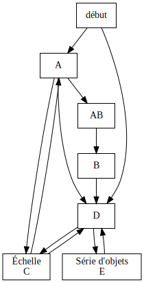

# Un diagramme d'états pour l'interface graphique de Pymecavideo #

Les premières versions de Pymecavidéo contenaient du code qui mélangeai de
façon confuse les actions à faire et la façon dont l'interface doit se
présenter à l'utilisateur. Il en est résulté des incohérences, difficiles
à rattraper, et aussi des régressions après une amélioration ponctuelle, qui
touchait à l'interface par effet de bord.

Pour y remédier, la fenêtre principale aura une propriété ```etat```, et
disposera d'un ```SLOT``` ```change_etat``` ; on pourra émettre des signaux
pour rappeler ce ```SLOT``` ; à chaque fois que la propriété ```etat```
prend une nouvelle valeur, des modifications sont faites dans l'interface
utilisateur. Il y a sept états : 

1. début
2. A
3. AB
4. B
5. C
6. D
7. E



## L'état de début ##

On y arrive quand on lance pymecavideo, et qu'aucune vidéo n'est passée, ni
par argument, ni par le fichier de configuration.

Tous les onglets sont désactivés ; idéalement, une aide pour dire d'aller
chercher un fichier vidéo apparaît.

## L'état A ##

Une vidéo est connue et on en affiche une image.

Le premier onglet est actif, on voit une image de la vidéo, les
contrôles pour se déplacer dans le film sont actifs, on peut modifier le
nombre d'objets à pointer, Le bouton Démarrer est visible et actif.

Inutile de montrer le bouton de réinitialisation

Sur l'image de la vidéo, le curseur est ordinaire.

## L'état AB ##
On y arrive en cliquant sur le bouton démarrer, si la case à cocher
« pointage auto » était cochée. On doit définir, par tirer-glisser à la
souris, autant de zones rectangulaires à suivre qu'il y a d'objets à
pointer.

Le premier onglet est actif, mais tous les widgets de contrôle y sont inactifs.

## L'état B ##

On y arrive en cliquant sur le bouton démarrer, si la case à cocher
« pointage auto » était cochée, après passage par l'état AB.

Une acquisition automatique est en cours.

Le premier onglet est actif, on voit une image de la vidéo, les
contrôles pour se déplacer dans le film sont désactivés, on ne peut pas
modifier le nombre d'objets à pointer, Le bouton Démarrer est caché,
remplacé par un bouton STOP.

## L'état C ##

L'échelle est en cours de définition.

Le premier onglet est actif, mais tous les boutons qu'on peut y voir
sont inactifs jusqu'à la fin de la définition de l'échelle.

Cet état peut se situer entre A et A, ou entre D et D.

## L'état D ##

On a « démarré », et une pointage manuel est possible. Tous les onglets
sont actifs.

Les contrôles pour changer d'image sont actifs, et le seul autre bouton actif
sur le premier onglet est celui qui permet de changer d'échelle.

Le pointage n'est possible que dans deux cas :

- quand aucune image n'a été pointée
- quand le pointage à venir est voisin de pointages existants : sur
  une image déjà pointée, ou juste avant, ou juste après.

Quand le pointage est possible et seulement alors, le curseur de souris
a la forme d'une grosse cible ; idéalement il identifie aussi l'objet à
pointer.

## L'état E ##

On est en train de pointer une série d'objets. Le curseur de souris
a la forme d'une grosse cible ; idéalement il identifie aussi l'objet à
pointer.

Durant ce pointage, les contrôles de changement d'image sont inactifs,
ainsi que les onglets autres que le premier.

